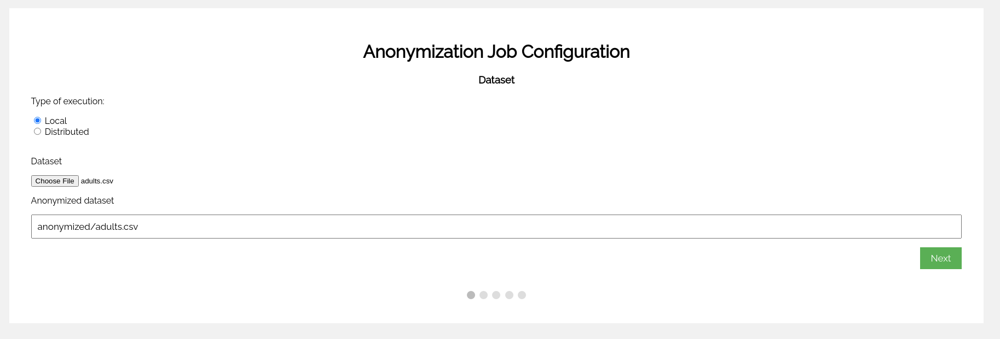
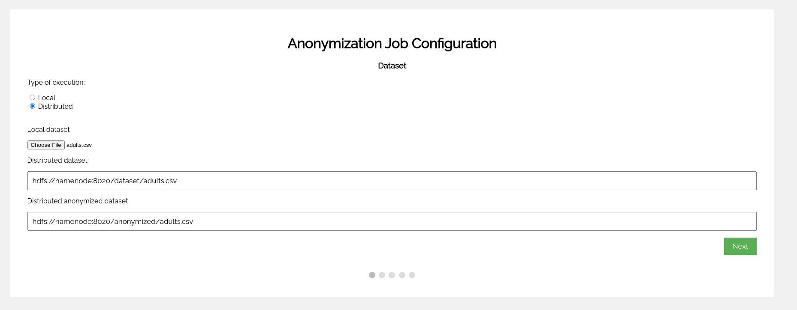
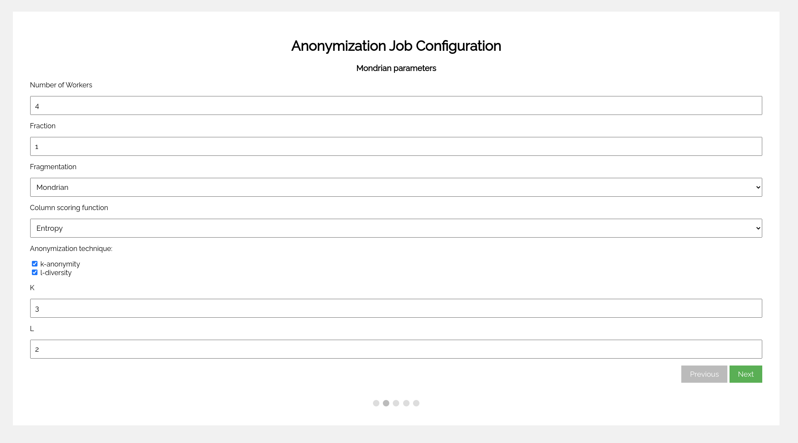
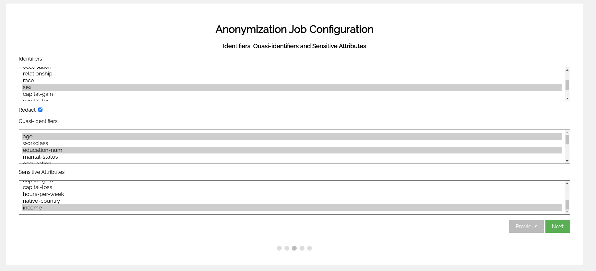
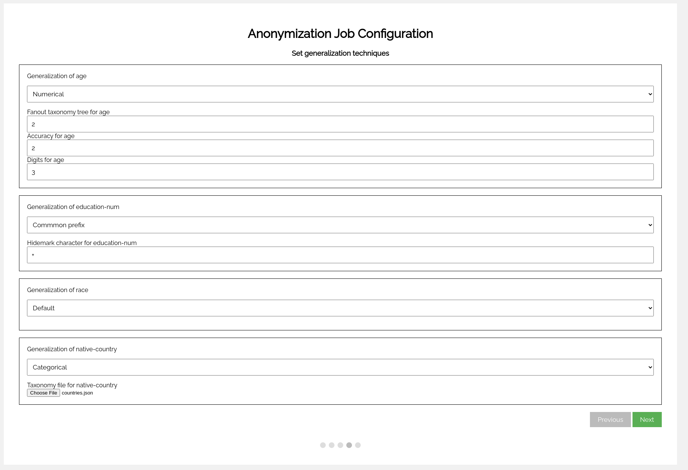
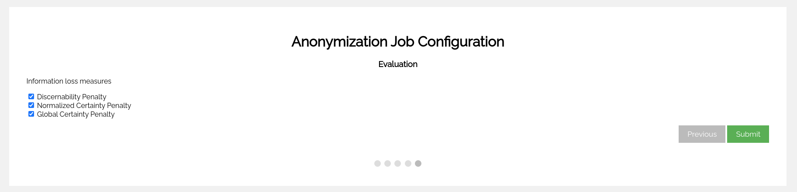

# Web interface

This guide shows how to use our web UI to define anonymize your own datasets. As anticipated you can start the web application with:
```shell
make ui
```
After the initial setup, a Flask application is exposed and it is reachable at localhost:5000.
The default number of workers available to do your anonymization jobs is 4, but it can be changed with:
```shell
make ui WORKERS=16
```
## Homepage
In the first page presented you can choose the type of run:
* **Local**: the run will use the Centralized version of the tool. This version is not Spark-Based and won't rely on the number of Spark Workers defined when the web UI has started. When this version is selected, the path in which the anonymized dataset will be stored has to be specified

* **Distributed**: the run will use the Spark-Based version of the tool and will rely on the number of Spark Workers defined  when the web UI has started. When this version is selected it is necessary to specify the HDFS path in which both the input dataset and the anonymized dataset will be stored.


In both type of runs, a local file must be given as input using the **Choose File** button.

## Mondrian parameters
This is the second configuration step presented. Here it is possible to configure:
* **Number of Workers**: the number of workers used in a distributed run. It value must be lower than the one specified when starting the tool. This option is available only in distributed runs
* **Fraction**: portion of the dataset used to determine the first fragments calculated locally. This number must be between 1 and 0. This option is available only in distributed runs
* **Fragmentation**: strategy used to the determine the first fragments calculated locally. This parameter has two possible values **Mondrian** and **Quantile**. The first method performs the cuts based on the median of the best scoring column of the partition considered; the second method performs the cuts based on the N-quantiles of the best scoring column, where N is the number of workers used. This option is available only in distributed runs
* **Column scoring function**: function used to calculate the best scoring column during cut decisions. The three value possible are **Span**, **Entropy**, **Negative Entropy**
* **k-anonymity**: check this option if you want to obtain k-anonymity on the input dataset. After checking this option, compile the textbox below the checkbox with the desired K parameter.
* **l-diversity**: check this option if you want to obtain l-diversity on the input dataset. After checking this option, compile the textbox below the checkbox with the desired L parameter.

## Identifiers, Quasi-identifiers and Sensitive Attributes
This is the third configuration step presented. Here it is possible to configure:
* **Identifiers**: it is possible to indicate the column that is used as an identifier. If the **Redact** option is checked, the selected column will be redacted from the output
* **Quasi-identifiers**: it is possible to indicate the columns that are considered quasi-identifiers by selecting them using *Ctrl + Click*
* **Sensitive Attributes**: if the l-diversity option is activated, it is possible to specify the sensitive column used to achieve l-diversity using *Ctrl + Click*

## Set generalization techniques
This is the fourth step presented. Here it is possible to configure the generalization technique used for each selected quasi-identifier. The supported techniques are:
* **Default**: the default technique groups data into ranges(for numerical data, e.g., [5 - 10]) or sets(for strings, e.g., {Private, Public})
* **Categorical**: this technique allows the user to provide a custom taxonomy. An example of a taxonomy file can be found [here](../distributed/taxonomy/countries.json)
* **Numerical**:  this technique builds a balanced tree constructed from the quasi-identifier numerical data based on fanout, accuracy and digits that can be specified in their corresponding textbox
* **Common prefix**: this technique groups data based on common prefixes of the data and redacts that part with the specified character (e.g., 100**)

## Evaluation
This is the last step presented. Here it is possible to choose what quality measures are calculated. To choose a measure check its corresponding checkbox. The possible values are  **Discernability Penalty**, **Normalized Certainty Penalty** and **Global Certainty Penalty**.


## Configuration file produced
Using the same configuration parameters presented in the images inside this guide, the following configuration file is created for a distributed run:
```json
{
   "K":3,
   "L":2,
   "column_score":"entropy",
   "fraction":1,
   "fragmentation":"mondrian",
   "id_columns":[
      "sex"
   ],
   "input":"hdfs://namenode:8020/dataset/adults.csv",
   "measures":[
      "discernability_penalty",
      "normalized_certainty_penalty",
      "global_certainty_penalty"
   ],
   "output":"hdfs://namenode:8020/anonymized/adults.csv",
   "quasiid_columns":[
      "age",
      "education-num",
      "race",
      "native-country"
   ],
   "quasiid_generalizations":[
      {
         "generalization_type":"numerical",
         "params":{
            "accuracy":2,
            "digits":3,
            "fanout":2
         },
         "qi_name":"age"
      },
      {
         "generalization_type":"common_prefix",
         "params":{
            "hide-mark":"+"
         },
         "qi_name":"education-num"
      },
      {
         "generalization_type":"categorical",
         "params":{
            "taxonomy_tree":"/mondrian/taxonomy/countries.json"
         },
         "qi_name":"native-country"
      }
   ],
   "redact":true,
   "sensitive_columns":[
      "income"
   ]
}
```

If a local run has been chosen in the first step, the following configuration file is created: 

```json
{
   "K":3,
   "L":2,
   "column_score":"entropy",
   "fragmentation":"mondrian",
   "id_columns":[
      "sex"
   ],
   "input":"dataset/adults.csv",
   "measures":[
      "discernability_penalty",
      "normalized_certainty_penalty",
      "global_certainty_penalty"
   ],
   "output":"anonymized/adults.csv",
   "quasiid_columns":[
      "age",
      "education-num",
      "race",
      "native-country"
   ],
   "quasiid_generalizations":[
      {
         "generalization_type":"numerical",
         "params":{
            "accuracy":2,
            "digits":3,
            "fanout":2
         },
         "qi_name":"age"
      },
      {
         "generalization_type":"common_prefix",
         "params":{
            "hide-mark":"+"
         },
         "qi_name":"education-num"
      },
      {
         "generalization_type":"categorical",
         "params":{
            "taxonomy_tree":"taxonomy/countries.json"
         },
         "qi_name":"native-country"
      }
   ],
   "redact":true,
   "sensitive_columns":[
      "income"
   ]
}
```
